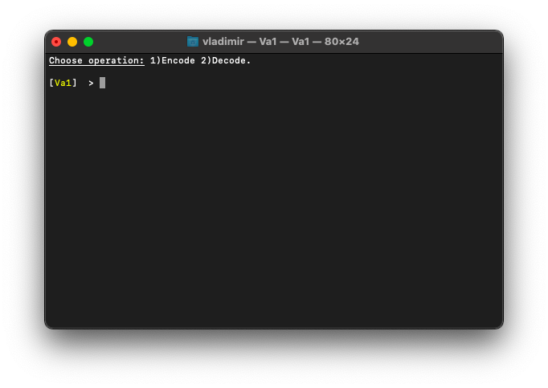
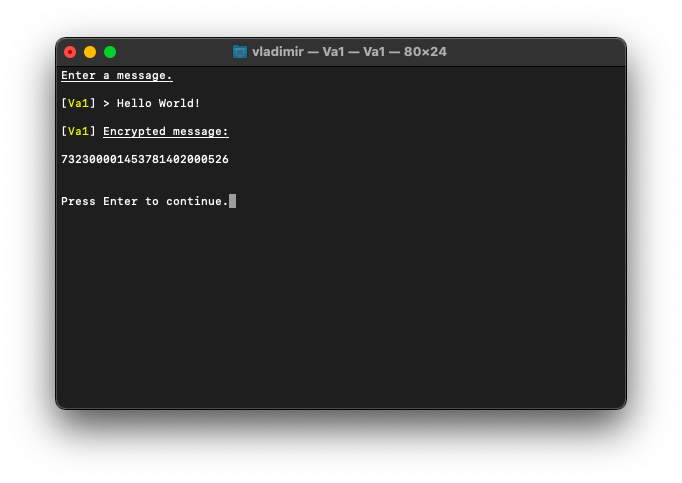
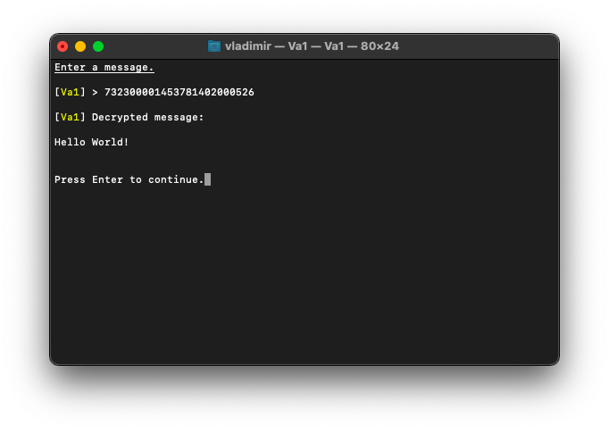

# 🔑 Va1 

> ‼️ *Patenting in process.* Don't try to steal or you'll lose your money.



## What is it?

_Va1_ is a simple character converter. It converts characters into nums(if , might be used in encryption protocols or as independent algorithm. It is a part of [_RedLibrary_](https://github.com/Red-company/RedLibrary).

## How it works?

_Va1_ uses the following table to substitute characters:
```
Main (nums only)
----------------

|---------|---|---|---|---|---|---|---|---|---|---|
| **Va1** | 0 | 1 | 2 | 3 | 4 | 5 | 6 | 7 | 8 | 9 |
|---------|---|---|---|---|---|---|---|---|---|---|
| 0       | l | p | r | t | u | d | h | f | c | n |
| 1       | v | w | b | j | o | y | a | z | m | k |
| 2       | x | s | q | e | i | g | ! | @ | ( | & |
| 3       | # | % | $ | * | ^ | ) | _ | + | > | = |
| 4       | < | - | . | , | : | | | ; | { | [ | ] |
| 5       | } | ? | " |' '| ` | ~ | G | 0 | 7 | 5 |
| 6       | 2 | 3 | 1 | 4 | 8 | 6 | 9 | L | P | R |
| 7       | T | U | D | H | F | C | N | V | W | B |
| 8       | J | O | Y | A | Z | M | K | X | S | Q |
| 9       | E | I | \r| \n| \t| \v| \e| \0| \ | \'|
|---------|---|---|---|---|---|---|---|---|---|---|


Additional (digits too):
------------------------

|---------|---|---|---|
| **Va1** | a | b | c |
|---------|---|---|---|
| 0       | \f| \a| \b|
|---------|---|---|---|
```
## How to use?

Function prototypes:

```C
// Encryption.
std::string * Va1Encode(const std::string *ToEnc);

// Decryption.
std::string * Va1Decode(const std::string *ToDec);
```

## Tech notes:

* It also understands characters like '\n', '\\' and some others.
* It's not fast but it still useful.

## Example:





##
All material in this repository is in the public domain.<br/>
With _**Copyright© ∞ [Vladimir Rogozin](https://github.com/red-sayed).**_
